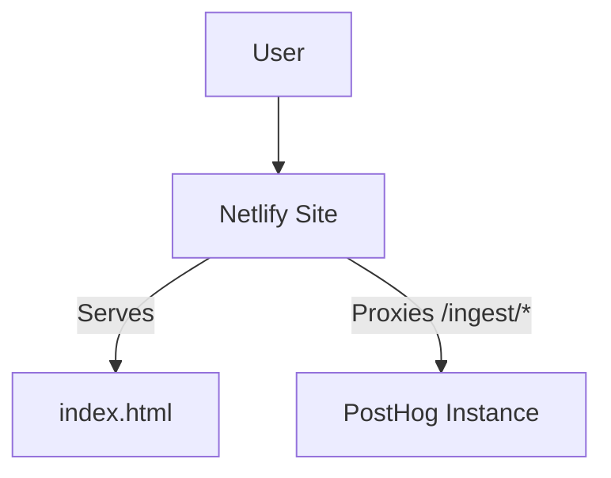

# System Patterns

## System Architecture

- **Frontend:** A static `index.html` file served by Netlify.
- **Backend/Proxy:** Netlify's redirect and proxy capabilities (`_redirects` or `netlify.toml` file) will be used to forward specific paths to a PostHog instance.

## Key Technical Decisions

- **Hosting and Proxy:** Netlify will be used for both hosting the static `index.html` and for implementing the reverse proxy.
- **Simplicity:** The initial `index.html` will be a minimal static page.

## Design Patterns in Use

- **Reverse Proxy:** The core pattern for this project.

## Component Relationships

